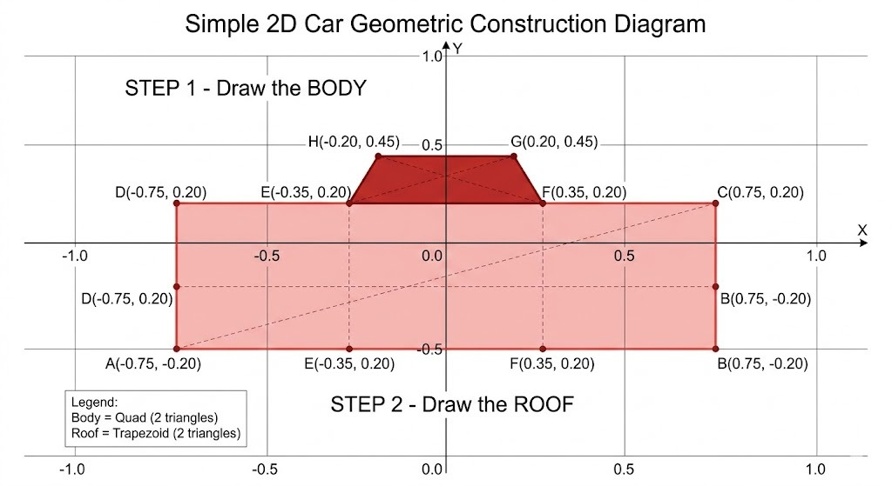
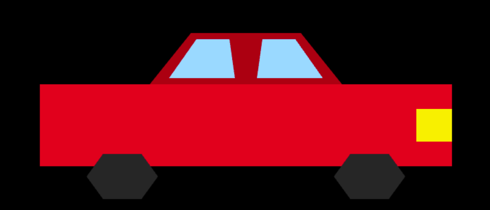

# Car in WebGL

A beginner-friendly WebGL project that builds a 2D car from scratch using only HTML, CSS, JavaScript, and raw WebGL.

This repository is intentionally simple: no frameworks, no helper libraries, and no build step. The focus is on understanding how coordinates, triangles, buffers, shaders, and transformation matrices come together to draw and animate a scene in the browser.

## Overview

The project is presented in two versions:

- `v1` introduces the car body and roof using hand-plotted vertices.
- `v2` expands the scene with wheels, windows, a headlight, and animation.

The workflow behind both versions is the same:

1. Sketch the car on a Cartesian plane.
2. Convert each shape into triangles.
3. Send the vertex data to WebGL buffers.
4. Render the geometry with shaders.
5. Apply transforms to animate the final model.

## What You Will Learn

- How WebGL coordinates map to a `-1` to `1` clip-space grid
- How to break rectangles, trapezoids, and hexagons into triangles
- How to store geometry and color data in buffers
- How vertex and fragment shaders work together
- How to animate a scene with transformation matrices

## Project Structure

```text
Car in WebGL/
|-- README.md
|-- assets/
|   |-- sketch.jpeg
|   |-- v1.png
|   |-- v2.png
|   `-- v3.mp4
|-- Car in webgl v1/
|   |-- index.html
|   |-- main.js
|   `-- style.css
`-- car in webgl v2/
    |-- index.html
    |-- main.js
    `-- style.css
```

## Build the Car

### Step 1: Sketch on the Cartesian Plane

Before writing code, the car is plotted on a grid. In WebGL, the visible area is described in normalized device coordinates, where both `x` and `y` run from `-1` to `1`.



The first version starts with two simple shapes:

- Body: a rectangle
- Roof: a trapezoid

Because WebGL renders triangles, each shape is split into triangle pairs.

### Step 2: Version 1

`v1` draws the main body of the car by writing the coordinates directly into a `vertices` array. The geometry is colorized with a matching `colors` array and rendered with a minimal shader pipeline.


Source: [`Car in webgl v1/`](Car%20in%20webgl%20v1/)

### Step 3: Version 2

`v2` keeps the same raw-WebGL approach and adds more detail:

- Wheels built from triangle fans shaped like hexagons
- Two window panels
- A front headlight



Source: [`car in webgl v2/`](car%20in%20webgl%20v2/)

### Step 4: Animation

The second version also introduces transformation matrices. A uniform matrix in the vertex shader scales and translates the entire car, which makes it drive across the screen with a slight bounce.

Demo video: [`assets/v3.mp4`](assets/v3.mp4)

## Key Ideas

- Sketch first, then code
- Everything becomes triangles
- Vertex coordinates map directly from the drawing
- Animation comes from matrix transforms, not redrawing the shape by hand

## Running the Project

You can open either version directly in a browser:

- `Car in webgl v1/index.html`
- `car in webgl v2/index.html`

There is no install step and no package manager setup.

If your browser blocks local file behavior, run a small local server in the project folder instead. For example:

```bash
python -m http.server 8000
```

Then open `http://localhost:8000/`.

## Why This Repo Exists

This project is meant to make WebGL feel less mysterious. Instead of hiding the graphics pipeline behind a framework, it keeps the math and rendering steps visible so you can see how a scene is constructed from first principles.

## License

Feel free to use, modify, and learn from this project.
